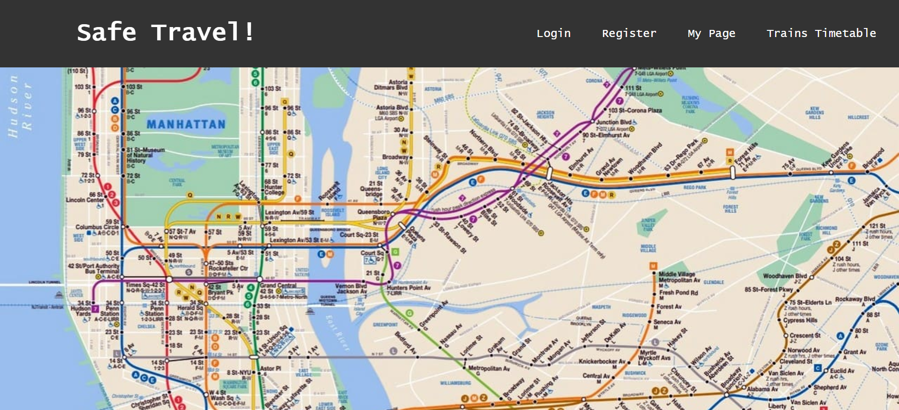
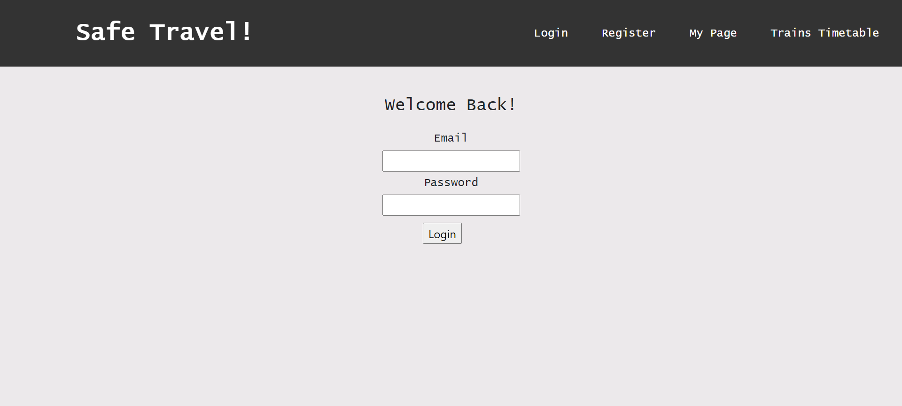
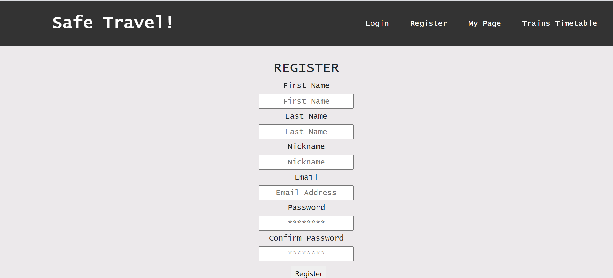
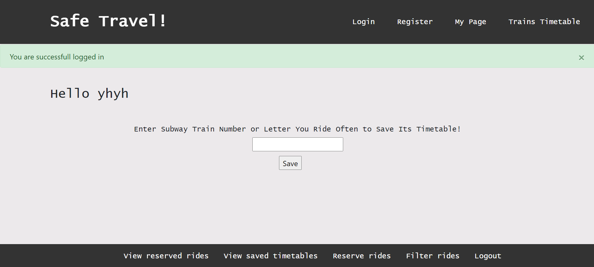
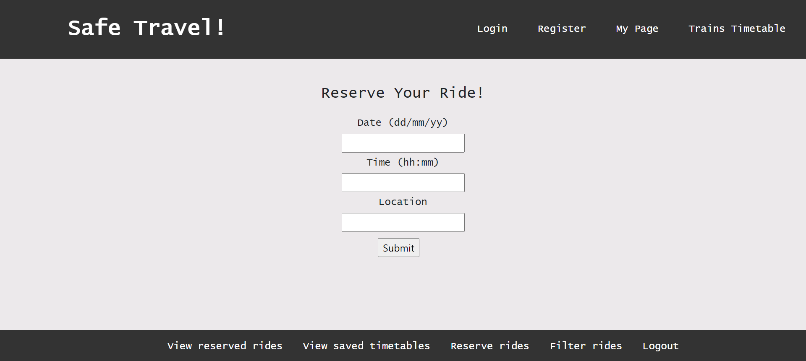
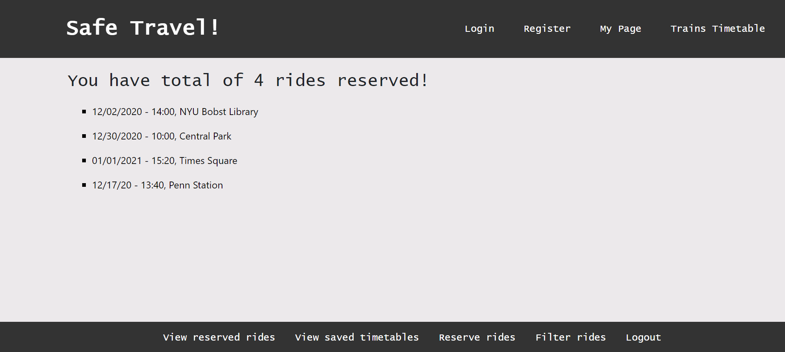
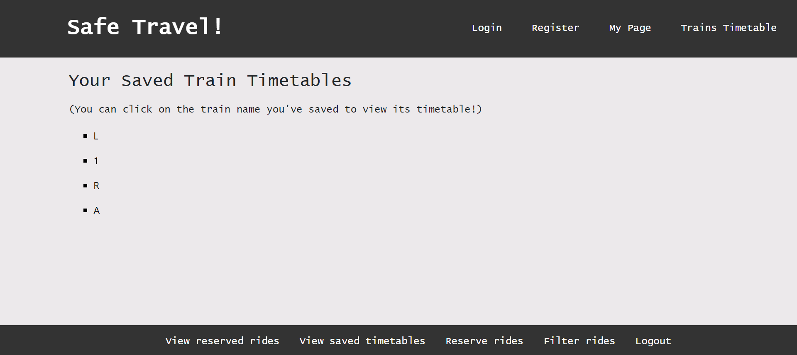
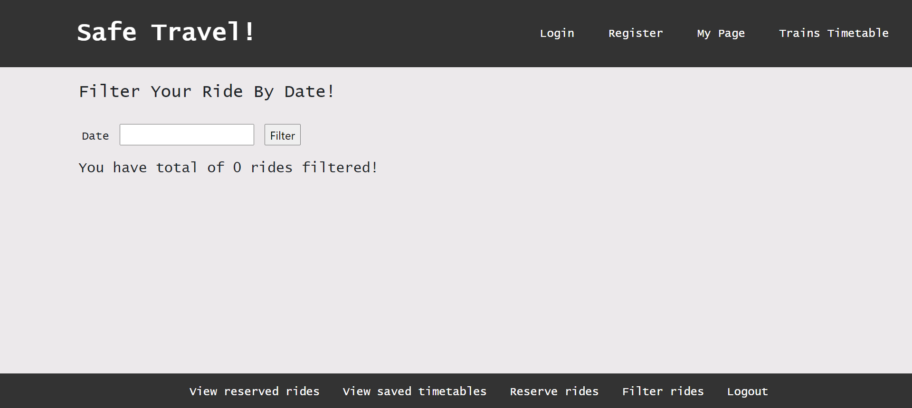
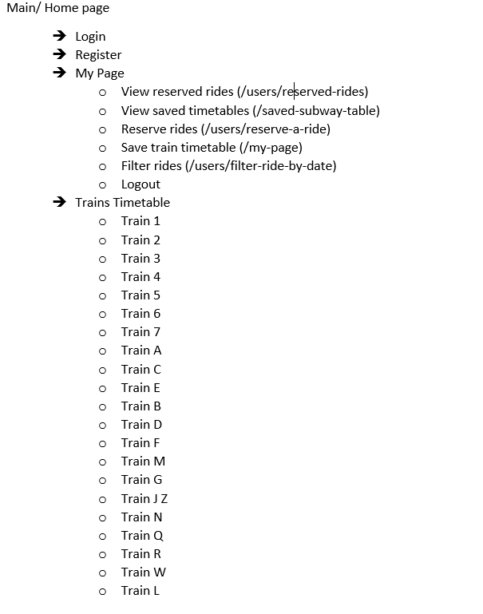

# Safe Travel!

## Overview

<!-- Now in the age of coronavirus, it is crucial to keep social distancing to avoid unnecessary contacts. 
The application 'Safe Travel!' grabs data from nyc.mta and displays in a graph how many people used the nyc subway
around which time. 
Using this information, users can decide if they want to schedule a private ride or take a subway ride.
Without having to go to Uber or other ride apps to reserve a ride, users can see the last week's subway data,
and either add the subway schedule to their page or reserve a ride and add that to their page.  -->
Now in the age of coronavirus, it has become crucial to keep social distancing wherever we go.
This application 'Safe Travel' provides users and guest users timetables of New York subway trains.
If users think that at certain time, there will be more subway riders than usual, they can choose
to make a note of private ride reservation details specifying date, time and location.
Users can also save subway train timetables they use often in their account so that they have access to the updated
timetable whenever they are in my-page. 


## Data Model

The application will store Users, and Subway Trains' Timetable 

* users can have two lists 
    (1. my reserved rides - which is consisted of objects; 2. my subway schedule - which is consisted of TrainSchSchema)
* each list can have multiple items


An Example User:

```javascript
{
  firstName: "Yaejin",
  lastName: "Han",
  nickname: "yhyh",
  email: "helloWorld@gmail.com",
  password: // a password hash,
  secretToken: // secret token generated by module randomstring,
  confirmedUser: true or false,
  myRides: [{date: "01/01/2021", time: "13:20", location: "NYU Bobst Library"}],
  myTrainSch: [{trainName: "2", link: "https://new.mta.info/document/...."}]
}
```

An Example of Subway train timetable list:

```javascript
{
  trainName: "2",
  link: "https://new.mta.info/document/...."
}
```


## [Link to Commented Final Version Schema](User.js) 

Final Version of Schema in User.js starts from line: 

https://github.com/nyu-csci-ua-0480-034-fall-2020/yaejinHan-final-project/blob/f226ee3ea5ef0c42091496ca2a6e254f03fa20b7/models/User.js#L3
## Wireframes

/     - main page or home page




/login - login page 




/users/register - registration page




/my-page - user's page after successful login




/users/reserve-a-ride - ride reservation page




/users/reserved-rides - page that shows user's reserved rides




/saved-subway-table - page that shows user's saved subway timetables




/users/filter-ride-by-date - page that filters user's saved rides by date




## Site map




## User Stories or Use Cases

1. as a non-registered user, I can view subway timetable of different subway trains using "Train Timetable" dropdown menu
2. as a non-registered user, I can sign up to the site
3. as a user, I can log in to the site
4. as a user, I can add subway train timetables that I use often to my page
5. as a user, I can reserve a ride to my page
6. as a user, I can view my reserved rides and saved time tables
7. as a user, I can filter my reserved rides by date

## Research Topics

* Integrate email verification for sign up
    * used email verification for a new user sign up
    * used a nodemailer module
    * nodemailer module sends an email to the address entered by the user 
    * included in the email is the secret token generated by the module randomstring
      which will be used to authenticate the user to set him/her as a confirmed user for the site 
* Integrate user login and registration
    * used passport-local strategy for authentication
    * used bcryptjs for crypting password
    * doesn't allow users to access my-page until they've logged in to the site
* Integrate Flash Messages in login, and registration process
    * used module connect-flash to do this
    * has error and success flash messages show up depending on to the situation
    * Created a flashMsg.hbs inside views/partials for flashMsg template reuse


<!-- 1. [nodemailer](http://blog.naver.com/sejun3278/221856823435)
2. [dropdown_menu_bar](https://www.w3schools.com/howto/howto_css_dropdown_navbar.asp
https://www.freecodecamp.org/news/how-to-use-html-to-open-link-in-new-tab/)
3. [passport-local](http://www.passportjs.org/docs/)(https://www.youtube.com/watch?v=6FOq4cUdH8k)
4. [secret_token_for_user_authentication](https://www.youtube.com/watch?v=gzDB0ZGOjA0)
5. [hbs_partials](https://handlebarsjs.com/guide/partials.html#partial-contexts)
6. [images_used](https://www.pngkit.com/bigpic/u2q8e6t4e6i1o0i1/)(https://archinect.com/news/article/150186751/influential-new-york-city-subway-map-designer-michael-hertz-has-died)(https://www.nycinsiderguide.com/nyc-subway-map)
7. [sticky_navbar](https://www.w3schools.com/howto/howto_js_navbar_sticky.asp) -->


